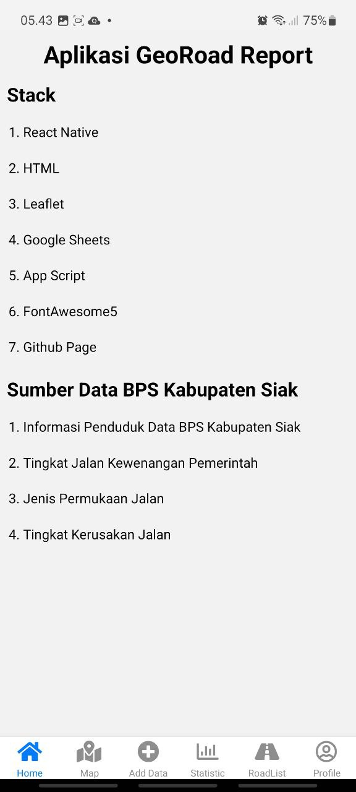
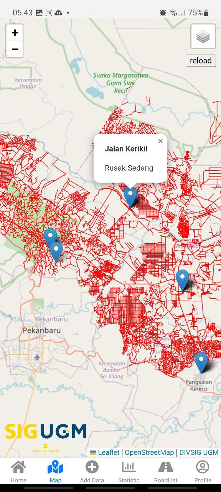
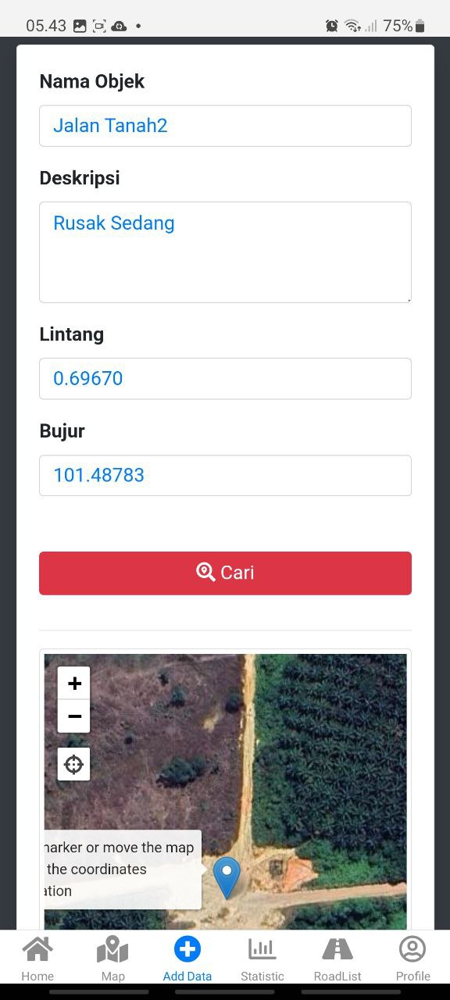
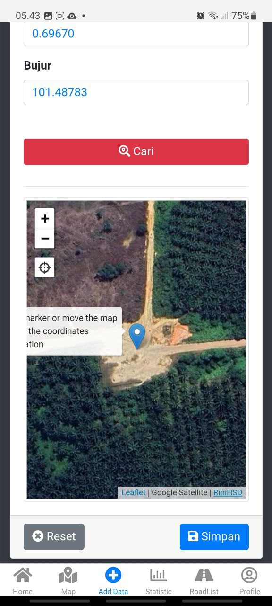
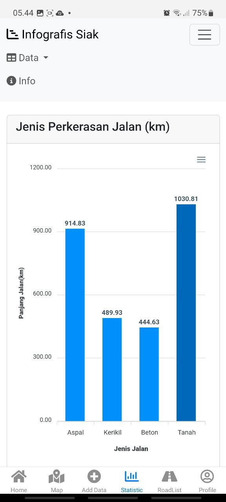
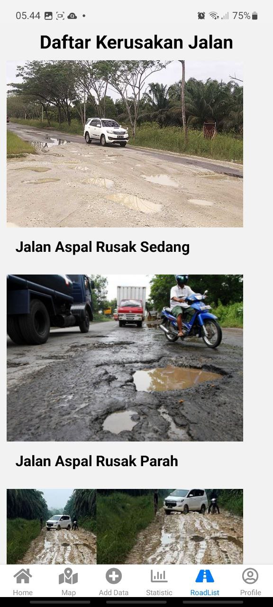

# GeoRoad Report

>**Note**: GeoRoad Report adalah aplikasi mobile GIS pelaporan jalan rusak dengan area kajian Kabupaten Siak, Provinsi Riau.

## Komponen Pembangun Produk
<ul>1. React Native</ul>
<ul>2. HTML</ul>
<ul>3. Leaflet JS</ul>
<ul>4. Google Sheets</ul>
<ul>5. App Script</ul>
<ul>6. FontAwesome5</ul>
<ul>7. Github Page</ul>

## Sumber Data
<ul>1. Informasi Jumlah Penduduk Data BPS Kabupaten Siak 2022</ul>
<ul>2. Tingkat Jalan Kewenangan Pemerintah BPS Kabupaten Siak 2022</ul>
<ul>3. Jenis Perkerasan Jalan BPS Kabupaten Siak 2022</ul>
<ul>4. Tingkat Kerusakan Jalan Data BPS Kabupaten Siak 2022</ul>

## Tangkapan Layar Komponen Penting Produk
1. 
2. 
3. 
4. 
5. 
6. 
7. 
8. 
